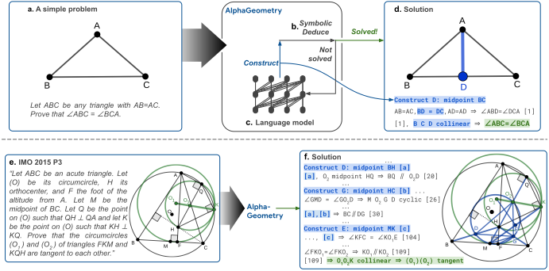

# Solving Olympiad Geometry without Human Demonstrations


This repository contains the code necessary to
reproduce DDAR and AlphaGeometry,
the two geometry theorem provers
introduced in the [Nature 2024](https://www.nature.com/articles/s41586-023-06747-5) paper:

*<center>"Solving Olympiad Geometry without Human Demonstrations".</center>*


</br>


<center>

</center>


## Dependencies

For the instructions presented below,
we use Python 3.10.9, and dependencies with their exact
version numbers listed in `requirements.txt`.

Our code depends on `meliad`, which is
not a registered package with `pip`. See instructions below
for how to manually install `meliad`.

Note that one can still run the DDAR solver
without the `meliad` and `sentencepiece` dependencies.

## Run the instructions

All instructions in this `README.md` can be run in one go by:

```
bash run.sh
```

Below, we explain these instructions step-by-step.

## Install dependencies, download weights and vocabulary.

Installation is done in a virtual environment:

```
virtualenv -p python3 .
source ./bin/activate
pip install --require-hashes -r requirements.txt
```

Download weights and vocabulary:

```
bash download.sh
DATA=ag_ckpt_vocab
```

Finally, install `meliad` separately as it is not
registered with `pip`:

```
MELIAD_PATH=meliad_lib/meliad
mkdir -p $MELIAD_PATH
git clone https://github.com/google-research/meliad $MELIAD_PATH
export PYTHONPATH=$PYTHONPATH:$MELIAD_PATH
```

## Set up common flags

Before running the python scripts,
let us first prepare some commonly used flags.
The symbolic engine needs definitions and deduction rules to operate.
These definitions and rules are provided in two text files
`defs.txt` and `rules.txt`.

```shell
DDAR_ARGS=(
  --defs_file=$(pwd)/defs.txt \
  --rules_file=$(pwd)/rules.txt \
);
```

Next, we define the flags relevant to the proof search.
To reproduce the simple examples below,
we use lightweight values for the proof search parameters:

```shell
BATCH_SIZE=2
BEAM_SIZE=2
DEPTH=2

SEARCH_ARGS=(
  --beam_size=$BEAM_SIZE
  --search_depth=$DEPTH
)
```

NOTE: The results in our paper can be obtained by setting
`BATCH_SIZE=32`, `BEAM_SIZE=512`, `DEPTH=16`
as described in section Methods.
To stay under IMO time limits, 4 V100-GPUs and 250 CPU workers
are needed as shown in Extended Data - Figure 1.
Note that we also strip away other memory/speed optimizations
due to internal dependencies and to promote code clarity.

Assume the downloaded checkpoint and vocabulary is placed in `DATA`,
and the installed `meliad` source code is at `MELIAD_PATH`.
We make use of the `gin` library to manage model configurations,
following `meliad` conventions. We now define the flags relevant to the
language model:

```shell
LM_ARGS=(
  --ckpt_path=$DATA \
  --vocab_path=$DATA/geometry.757.model
  --gin_search_paths=$MELIAD_PATH/transformer/configs,$(pwd) \
  --gin_file=base_htrans.gin \
  --gin_file=size/medium_150M.gin \
  --gin_file=options/positions_t5.gin \
  --gin_file=options/lr_cosine_decay.gin \
  --gin_file=options/seq_1024_nocache.gin \
  --gin_file=geometry_150M_generate.gin \
  --gin_param=DecoderOnlyLanguageModelGenerate.output_token_losses=True \
  --gin_param=TransformerTaskConfig.batch_size=$BATCH_SIZE \
  --gin_param=TransformerTaskConfig.sequence_length=128 \
  --gin_param=Trainer.restore_state_variables=False
);
```

TIP: Note that you can still run the DDAR solver
without defining `SEARCH_ARGS` and `LM_ARGS`.
In such case, simply disable the import of the `lm_inference` module
inside `alphageometry.py`.

## Run DDAR

The script loads a problem by reading a list of problems
from a text file and solves the specific problem in the list according
to its name. We pass these two pieces of information through the flags
`--problems_file` and `--problem_name`.
We use `--mode=ddar` to indicate that we want to use the DDAR solver.

Below we showed this solver solving IMO 2000 P1:

```shell
python -m alphageometry \
--alsologtostderr \
--problems_file=$(pwd)/imo_ag_30.txt \
--problem_name=translated_imo_2000_p1 \
--mode=ddar \
"${DDAR_ARGS[@]}"
```

Expect the following output

```shell
graph.py:468] translated_imo_2000_p1
graph.py:469] a b = segment a b; g1 = on_tline g1 a a b; g2 = on_tline g2 b b a; m = on_circle m g1 a, on_circle m g2 b; n = on_circle n g1 a, on_circle n g2 b; c = on_pline c m a b, on_circle c g1 a; d = on_pline d m a b, on_circle d g2 b; e = on_line e a c, on_line e b d; p = on_line p a n, on_line p c d; q = on_line q b n, on_line q c d ? cong e p e q
ddar.py:41] Depth 1/1000 time = 1.7772269248962402
ddar.py:41] Depth 2/1000 time = 5.63526177406311
ddar.py:41] Depth 3/1000 time = 6.883412837982178
ddar.py:41] Depth 4/1000 time = 10.275688409805298
ddar.py:41] Depth 5/1000 time = 12.048273086547852
alphageometry.py:190]
==========================
 * From theorem premises:
A B G1 G2 M N C D E P Q : Points
AG_1 ⟂ AB [00]
BA ⟂ G_2B [01]
G_2M = G_2B [02]
G_1M = G_1A [03]

...
[log omitted]
...

036. ∠QEB = ∠(QP-EA) [46] & ∠(BE-QP) = ∠AEP [55] ⇒  ∠EQP = ∠QPE [56]
037. ∠PQE = ∠EPQ [56] ⇒  EP = EQ

==========================
```

The output first includes a list of relevant premises that it uses,
and then proof steps that gradually build up the proof.
All predicates are numbered to track how they are derived
from the premises, and to show that the proof is fully justified.

TIP: Additionally passing the flag `--out_file=path/to/output/text/file.txt`
will write the proof to a text file.

Running on all problems in `imo_ag_30.txt` will yield solutions to
14 of them, as reported in Table 1 in our paper.

## Run AlphaGeometry:

As a simple example, we load `--problem_name=orthocenter`
from `--problem_file=examples.txt`.
This time, we pass `--mode=alphageometry` to use the AlphaGeometry solver
and pass the `SEARCH_ARGS` and `LM_ARGS` flags.

```shell
python -m alphageometry \
--alsologtostderr \
--problems_file=$(pwd)/examples.txt \
--problem_name=orthocenter \
--mode=alphageometry \
"${DDAR_ARGS[@]}" \
"${SEARCH_ARGS[@]}" \
"${LM_ARGS[@]}"
```

Expect the following output:

```shell
...
[log omitted]
...
training_loop.py:725] Total parameters: 152072288
training_loop.py:739] Total state size: 0
training_loop.py:492] Training loop: creating task for mode beam_search

graph.py:468] orthocenter
graph.py:469] a b c = triangle a b c; d = on_tline d b a c, on_tline d c a b ? perp a d b c
ddar.py:41] Depth 1/1000 time = 0.009987592697143555 branch = 4
ddar.py:41] Depth 2/1000 time = 0.00672602653503418 branch = 0
alphageometry.py:221] DD+AR failed to solve the problem.
alphageometry.py:457] Depth 0. There are 1 nodes to expand:
alphageometry.py:460] {S} a : ; b : ; c : ; d : T a b c d 00 T a c b d 01 ? T a d b c {F1} x00
alphageometry.py:465] Decoding from {S} a : ; b : ; c : ; d : T a b c d 00 T a c b d 01 ? T a d b c {F1} x00
...
[log omitted]
...
alphageometry.py:470] LM output (score=-1.102287): "e : C a c e 02 C b d e 03 ;"
alphageometry.py:471] Translation: "e = on_line e a c, on_line e b d"

alphageometry.py:480] Solving: "a b c = triangle a b c; d = on_tline d b a c, on_tline d c a b; e = on_line e a c, on_line e b d ? perp a d b c"
graph.py:468]
graph.py:469] a b c = triangle a b c; d = on_tline d b a c, on_tline d c a b; e = on_line e a c, on_line e b d ? perp a d b c
ddar.py:41] Depth 1/1000 time = 0.021120786666870117
ddar.py:41] Depth 2/1000 time = 0.033370018005371094
ddar.py:41] Depth 3/1000 time = 0.04297471046447754
alphageometry.py:140]
==========================
 * From theorem premises:
A B C D : Points
BD ⟂ AC [00]
CD ⟂ AB [01]

 * Auxiliary Constructions:
E : Points
E,B,D are collinear [02]
E,C,A are collinear [03]

 * Proof steps:
001. E,B,D are collinear [02] & E,C,A are collinear [03] & BD ⟂ AC [00] ⇒  ∠BEA = ∠CED [04]
002. E,B,D are collinear [02] & E,C,A are collinear [03] & BD ⟂ AC [00] ⇒  ∠BEC = ∠AED [05]
003. A,E,C are collinear [03] & E,B,D are collinear [02] & AC ⟂ BD [00] ⇒  EC ⟂ EB [06]
004. EC ⟂ EB [06] & CD ⟂ AB [01] ⇒  ∠(EC-BA) = ∠(EB-CD) [07]
005. E,C,A are collinear [03] & E,B,D are collinear [02] & ∠(EC-BA) = ∠(EB-CD) [07] ⇒  ∠BAE = ∠CDE [08]
006. ∠BEA = ∠CED [04] & ∠BAE = ∠CDE [08] (Similar Triangles)⇒  EB:EC = EA:ED [09]
007. EB:EC = EA:ED [09] & ∠BEC = ∠AED [05] (Similar Triangles)⇒  ∠BCE = ∠ADE [10]
008. EB:EC = EA:ED [09] & ∠BEC = ∠AED [05] (Similar Triangles)⇒  ∠EBC = ∠EAD [11]
009. ∠BCE = ∠ADE [10] & E,C,A are collinear [03] & E,B,D are collinear [02] & ∠EBC = ∠EAD [11] ⇒  AD ⟂ BC
==========================

alphageometry.py:505] Solved.
```

NOTE: Point `H` is automatically renamed to `D`,
as the LM is trained on synthetic problems
where the points are named alphabetically, and so it expects
the same during test time.

NOTE: In this implementation of AlphaGeometry,
we removed all optimizations that are dependent on
internal infrastructure, e.g.,
parallelized model inference on multi GPUs,
parallelized DDAR on multiple CPUs,
parallel execution of LM and DDAR,
shared pool of CPU workers across different problems, etc.
We also removed some memory/speed optimizations and code
abstractions in favor of code clarity.

As can be seen in the output, initially DDAR failed to solve the problem.
The LM proposes two auxiliary constructions (because `BATCH_SIZE=2`):

* `e = eqdistance e c a b, eqdistance e b a c`, i.e.,
construct `E` as the intersection of circle (center=C, radius=AB) and
circle (center=B, radius=AC). This construction has a score of `-1.186`.
* `e = on_line e a c, on_line e b d`, i.e.,
`E` is the intersection of `AC` and `BD`.
This construction has a higher score (`-1.102287`) than the previous.

Since the second construction has a higher score, DDAR attempted the second
construction first and found the solution right away.
The proof search therefore terminates and there is no second iteration.

## Results

Before attempting to reproduce the AlphaGeometry numbers in our paper,
please make sure to pass all tests in the prepared test suite:

```
bash run_tests.sh
```

Then, pass the corresponding values for `--problem_file` (column)
and `--mode` (row), and
iterate on all problems to obtain the following results:

<center>

<b>Number of solved problems:</b>

|          | `imo_ag_30.txt`  | `jgex_ag_231.txt` |
|----------|------------------|-------------------|
| `ddar`   | 14               | 198               |
| `alphageometry`     | 25               | 228               |

</center>

## Source code description

Files in this repository include python modules/scripts to run the solvers and
resource files necessary for the script to execute. We listed below
each of them and their description.

| File name              | Description                                                                        |
|------------------------|------------------------------------------------------------------------------------|
| `geometry.py`          | Implements nodes (Point, Line, Circle, etc) in the proof state graph.              |
| `numericals.py`        | Implements the numerical engine in the dynamic geometry environment.               |
| `graph_utils.py`       | Implements utilities for the proof state graph.                                    |
| `graph.py`             | Implements the proof state graph.                                                  |
| `problem.py`           | Implements the classes that represent the problem premises, conclusion, DAG nodes. |
| `dd.py`                | Implements DD and its traceback.                                                   |
| `ar.py`                | Implements AR and its traceback.                                                   |
| `trace_back.py`        | Implements the recursive traceback and dependency difference algorithm.            |
| `ddar.py`              | Implements the combination DD+AR.                                                  |
| `beam_search.py`       | Implements beam decoding of a language model in JAX.                               |
| `models.py`            | Implements the transformer model.                                                  |
| `transformer_layer.py` | Implements the transformer layer.                                                  |
| `decoder_stack.py`     | Implements the transformer decoder stack.                                          |
| `lm_inference.py`      | Implements an interface to a trained LM to perform decoding.                       |
| `alphageometry.py`                | Main script that loads problems, calls DD+AR or AlphaGeometry solver, and prints solutions.   |
| `pretty.py`            | Pretty formating the solutions output by solvers.                                  |
| `*_test.py`            | Tests for the corresponding module.                                                |
| `download.sh`          | Script to download model checkpoints and LM                                        |
| `run.sh`               | Script to execute instructions in README.                                          |
| `run_tests.sh`         | Script to execute the test suite.                                                  |


Resource files:

| Resource file name     | Description                                                                        |
|------------------------|------------------------------------------------------------------------------------|
| `defs.txt`             | Definitions of different geometric construction actions.                           |
| `rules.txt`            | Deduction rules for DD.                                                            |
| `geometry_150M_generate.gin`| Gin config of the LM implemented in meliad.                                   |
| `imo_ag_30.txt`        | Problems in IMO-AG-30.                                                             |
| `jgex_ag_231.txt`      | Problems in JGEX-AG-231.                                                           |


## Citing this work

```bibtex
@Article{AlphaGeometryTrinh2024,
  author  = {Trinh, Trieu and Wu, Yuhuai and Le, Quoc and He, He and Luong, Thang},
  journal = {Nature},
  title   = {Solving Olympiad Geometry without Human Demonstrations},
  year    = {2024},
  doi     = {10.1038/s41586-023-06747-5}
}
```

## Acknowledgements

This research is a collaboration between the Google Brain team
(now Google Deepmind) and
the Computer Science Department of New York University.
We thank Rif A. Saurous, Denny Zhou, Christian Szegedy, Delesley Hutchins,
Thomas Kipf, Hieu Pham, Petar Veličković, Debidatta Dwibedi,
Kyunghyun Cho, Lerrel Pinto, Alfredo Canziani,
Thomas Wies, He He’s research group,
Evan Chen (the USA’s IMO team coach),
Mirek Olsak, Patrik Pak,
and all three Nature's referees for their help and support.

The code of AlphaGeometry communicates with and/or references the following
separate libraries and packages:

*   [Abseil](https://github.com/abseil/abseil-py)
*   [JAX](https://github.com/google/jax/)
*   [matplotlib](https://matplotlib.org/)
*   [NumPy](https://numpy.org)
*   [SciPy](https://scipy.org)
*   [TensorFlow](https://github.com/tensorflow/tensorflow)
*   [Meliad](https://github.com/google-research/meliad)
*   [Flax](https://github.com/google/flax)
*   [Gin](https://github.com/google/gin-config)
*   [T5](https://github.com/google-research/text-to-text-transfer-transformer)
*   [SentencePiece](https://github.com/google/sentencepiece)


We thank all their contributors and maintainers!


## Disclaimer

This is not an officially supported Google product.

This research code is provided "as-is" to the broader research community.
Google does not promise to maintain or otherwise support this code in any way.

## Code License

Copyright 2023 DeepMind Technologies Limited

All software is licensed under the Apache License, Version 2.0 (Apache 2.0);
you may not use this file except in compliance with the Apache 2.0 license.
You may obtain a copy of the Apache 2.0 license at:
https://www.apache.org/licenses/LICENSE-2.0

All other materials are licensed under the Creative Commons Attribution 4.0
International License (CC-BY). You may obtain a copy of the CC-BY license at:
https://creativecommons.org/licenses/by/4.0/legalcode

Unless required by applicable law or agreed to in writing, all software and
materials distributed here under the Apache 2.0 or CC-BY licenses are
distributed on an "AS IS" BASIS, WITHOUT WARRANTIES OR CONDITIONS OF ANY KIND,
either express or implied. See the licenses for the specific language governing
permissions and limitations under those licenses.

## Model Parameters License

The AlphaGeometry checkpoints and vocabulary are made available
under the terms of the Creative Commons Attribution 4.0
International (CC BY 4.0) license.
You can find details at:
https://creativecommons.org/licenses/by/4.0/legalcode

